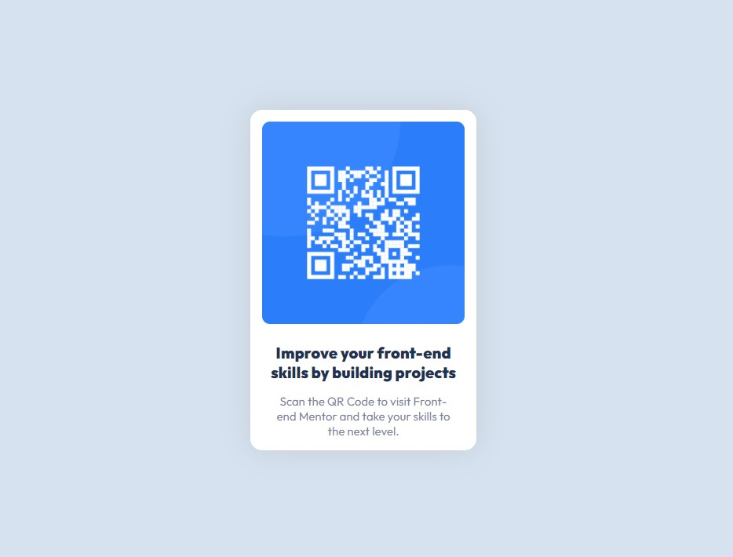

# Frontend Mentor - QR code component solution

This is a solution to the [QR code component challenge on Frontend Mentor](https://www.frontendmentor.io/challenges/qr-code-component-iux_sIO_H). Frontend Mentor challenges help you improve your coding skills by building realistic projects. 

## Table of contents

- [Overview](#overview)
  - [Screenshot](#screenshot)
  - [Links](#links)
- [My process](#my-process)
  - [Built with](#built-with)
  - [What I learned](#what-i-learned)
  - [Continued development](#continued-development)
  - [Useful resources](#useful-resources)
- [Author](#author)
- [Acknowledgments](#acknowledgments)


## Overview

### Screenshot



### Links


- Live Site URL: [QR-Code](https://xulab5.github.io/QR-Code/)

### Built with

- Semantic HTML5 markup
- CSS custom properties

### Code Snippets

```html
<main>
  <div class="container">
    <div class="qr-code">
      
    </div>
    <div class="bottom-text">
      <p class="title">
        Improve your front-end skills by building projects
      </p>
      <p class="body-text">
        Scan the QR Code to visit Front-end Mentor and take your skills to the next level.
      </p>
    </div>
  </div>
</main>  
  <div class="attribution">
    Challenge by <a href="https://www.frontendmentor.io?ref=challenge" target="_blank">Frontend Mentor</a>. 
    Coded by <a href="https://substeven.netlify.app/" title="See Xulab personal website">Xulab</a>.
  </div>
```


### Continued development

I'm not a newbie when it comes to web development bu I'm not a pro either. On a scale of 1-10, I'd rate myself a 7. I want to learn more of Javascript and at least a server side programming language like PHP.

## Author

- Website - [Xulab](https://substeven.netlify.app/)
- Frontend Mentor - [@Xulab5](https://www.frontendmentor.io/profile/Xulab5)
- Instagram - [@Xulab](https://www.instagram.com/xulab05/)

## Acknowledgments

I'd like to give thanks to Front-end Mentor for this awesome small project.
